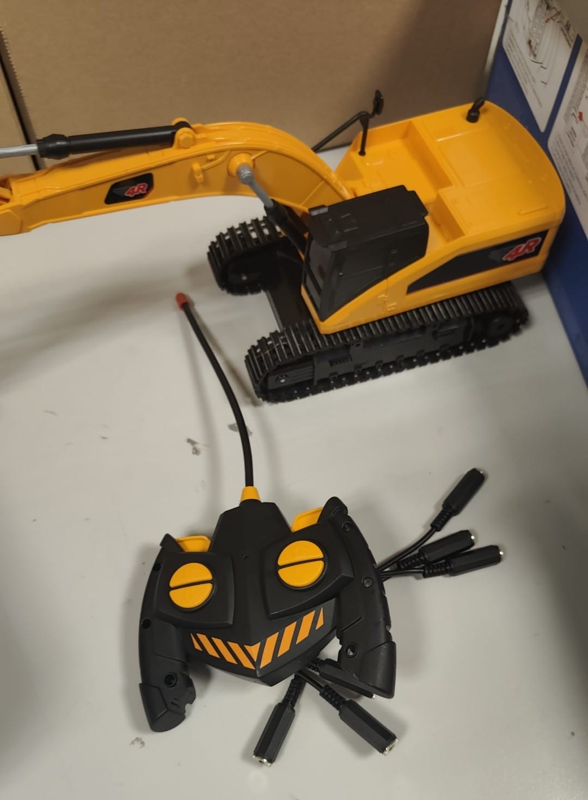
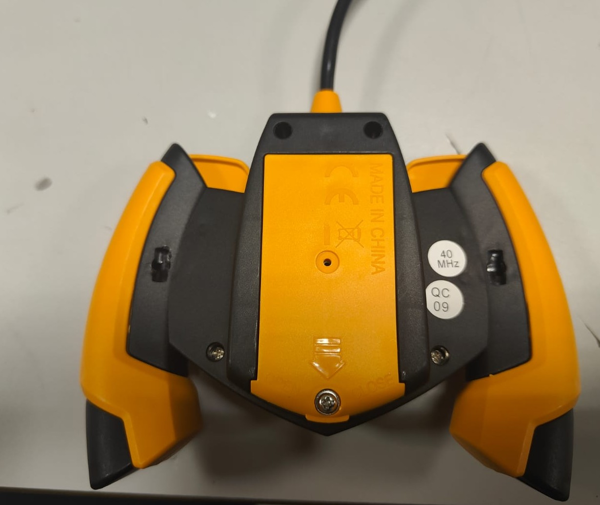
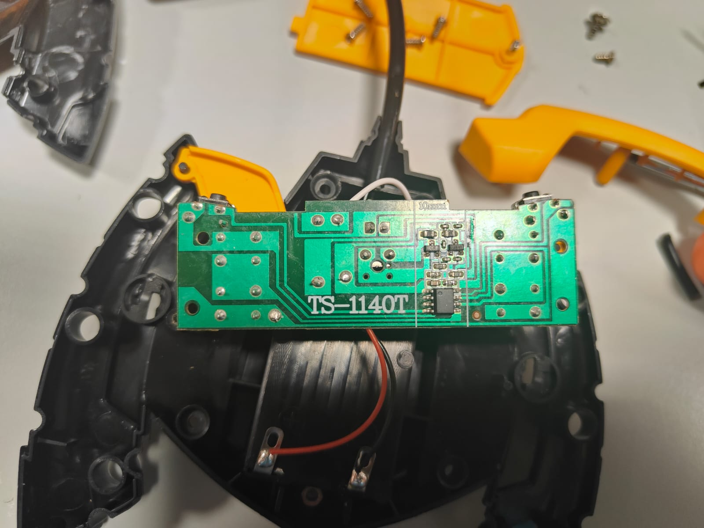
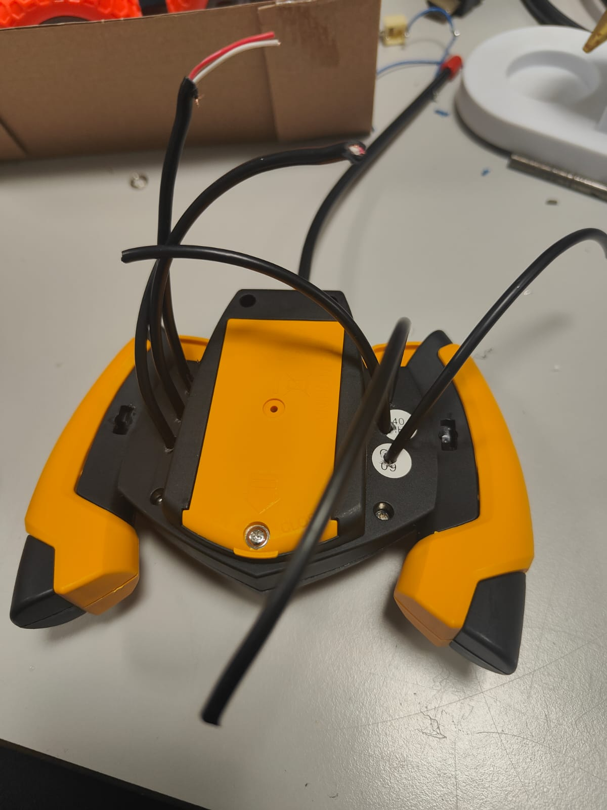
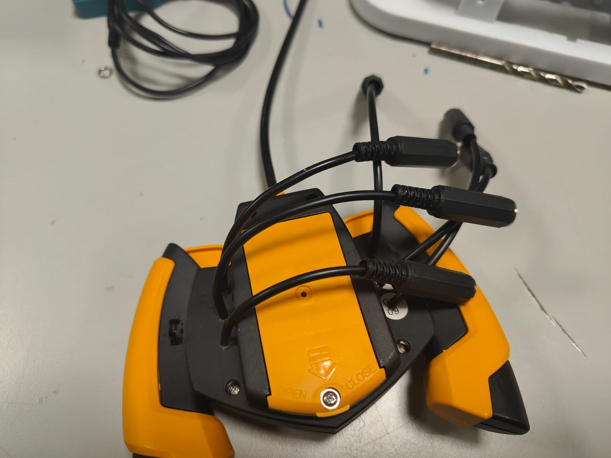
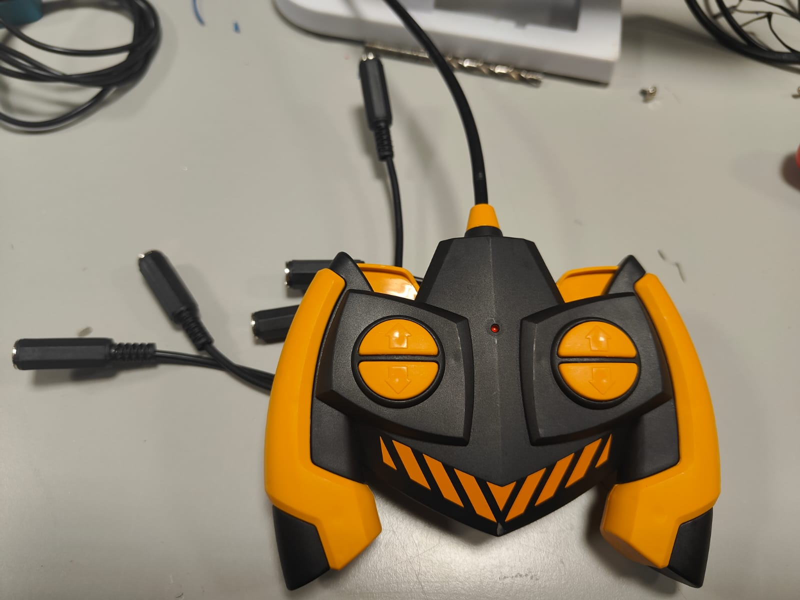

# Modificación Excavadora Radiocontrol

## Descripción del Proyecto
Este proyecto consiste en modificar una excavadora de juguete radiocontrol para mejorar su accesibilidad. Con esta guía detallada, podrás transformar un juguete común en un modelo personalizado y único.

## Lista de Materiales
A continuación, se muestra una lista de los materiales necesarios para este proyecto. Asegúrate de tener todo listo antes de comenzar:

- Excavadora radiocontrol.
- Soldador y estaño.
- 6 x Cableado adicional.
- 6 x Conectores Jack Hembra.
- Herramientas de mano (destornillador, alicates, cúter).
- Taladro y brocas.

## Requisitos Previos
Antes de comenzar, asegúrate de tener conocimientos básicos sobre:
- Uso seguro de herramientas como soldadores y taladros.

## Pasos Iniciales
1. **Preparar el área de trabajo**:
   - Asegúrate de tener un espacio limpio y bien iluminado.
   - Organiza todas las herramientas y materiales.

2. **Revisión de la excavadora**:
   - Inspecciona la excavadora para identificar los componentes existentes.

## Modificación del Mando
1. **Acceso al interior del mando**:
   - Da la vuelta al mando de la excavadora.
   - Localiza y retira todos los tornillos visibles utilizando un destornillador adecuado.
   - Nota: No es necesario quitar la tapa del compartimento del portapilas.

2. **Retirar carcasas externas**:
   - Localiza la carcasa amarilla de la antena y retírala cuidadosamente para poder abrir el mando.
   - Retira también las carcasas amarillas de los laterales. Estas piezas suelen estar muy ajustadas, por lo que es importante hacerlo con paciencia y cuidado para evitar lesiones o daños.

3. **Inspección de la placa del mando**:
   - Una vez retirada la carcasa superior, se revelará la placa del mando.
   - Observa que la placa tiene 6 pulsadores. Para modificarlos, necesitarás:
     - Preparar 6 trozos de cable.
     - Realizar 6 taladros en la parte trasera del mando.

4. **Soldadura de cables**:
   - Da la vuelta a la parte trasera del mando para localizar los puntos de soldadura para los cables.
   - Suelda cuidadosamente cada uno de los 6 cables en los puntos correspondientes.

5. **Reensamblar el mando**:
   - Pasa los cables soldados por la parte trasera del mando.
   - Atornilla nuevamente la placa en su lugar.
   - Coloca la carcasa superior y atornilla todas las piezas.
   - Reinstala las carcasas amarillas de los laterales y de la antena.

6. **Conexión de jacks hembra**:
   - Suelda los jacks hembra necesarios para la conexión de los controles externos.

7. **Pruebas y ajustes finales**:
   - Con el mando completamente montado, realiza pruebas para asegurarte de que todo funcione correctamente.
   - ¡Disfruta probando el juguete!

